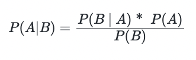
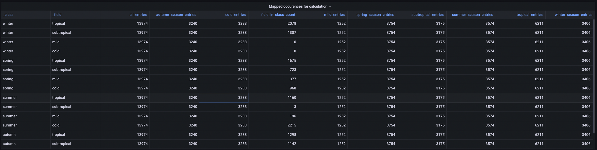
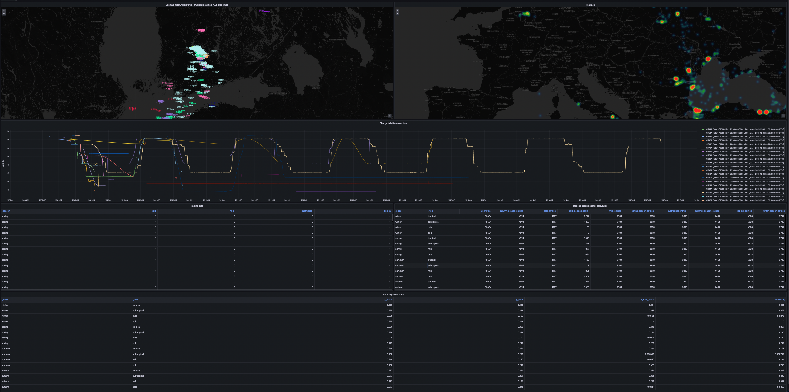

# Building, visualizing and classifying a NoSQL time series data store using InfluxDB2, Python and Grafana

<center>

|             |                              |
|-------------|------------------------------|
| Author:     | Philipp Moritzer             |
|             | 5034255                      |
|             | pmoritzer@stud.hs-bremen.de  |
|             |                              |
| Supervisor: | Prof. Dr.-Ing. Uta Bohnebeck |
|             | uta.bohnebeck@hs-bremen.de   |
|             | Hochschule Bremen            |
|             |                              |
| Submission: | 31st July 2022               |
</center>

<div style="page-break-after: always;"></div>

# Table of contents
- [Building, visualizing and classifying a NoSQL time series data store using InfluxDB2, Python and Grafana](#building-visualizing-and-classifying-a-nosql-time-series-data-store-using-influxdb2-python-and-grafana)
- [Table of contents](#table-of-contents)
- [Introduction](#introduction)
- [Fundamentals](#fundamentals)
  - [NoSQL basics](#nosql-basics)
  - [NoSQL vs Relational Databases](#nosql-vs-relational-databases)
  - [Time Series Databases](#time-series-databases)
  - [Why use a time series database](#why-use-a-time-series-database)
  - [InfluxDB basics](#influxdb-basics)
    - [Flux Query Language](#flux-query-language)
    - [InfluxDB vs Timescale vs Prometheus](#influxdb-vs-timescale-vs-prometheus)
  - [Naive Bayes Classification](#naive-bayes-classification)
- [Tutorial](#tutorial)
  - [Goals](#goals)
  - [The data - Movebank: Animal tracking](#the-data---movebank-animal-tracking)
  - [Prerequisites](#prerequisites)
  - [Spinning up the composition](#spinning-up-the-composition)
    - [docker-compose](#docker-compose)
  - [Setting up InfluxDB](#setting-up-influxdb)
  - [Writing the client application](#writing-the-client-application)
    - [Setting up the environment](#setting-up-the-environment)
    - [Setting up the application](#setting-up-the-application)
    - [Implementing functionality](#implementing-functionality)
  - [Setting up Grafana](#setting-up-grafana)
    - [Defining InfluxDB as a data source](#defining-influxdb-as-a-data-source)
    - [Creating a dashboard](#creating-a-dashboard)
  - [Visualizing and analyising the data](#visualizing-and-analyising-the-data)
    - [Dashboard variables](#dashboard-variables)
    - [Geomap & Heatmap](#geomap--heatmap)
    - [Latitude over time](#latitude-over-time)
    - [Classification](#classification)
- [Summary](#summary)
  - [Result](#result)
  - [Conclusion](#conclusion)
  - [Outlook](#outlook)
  - [Repository and sample project](#repository-and-sample-project)
  - [Demo](#demo)
- [Sources](#sources)

<div style="page-break-after: always;"></div>


# Introduction
Big Data, IoT, and analytics, and as a result, new methods of storing this fluid data have emerged. Almost all streaming data, particularly IoT data, but also real-time analytics and server and application monitoring, has a time stamp and thus is time series data. This project will go on to demonstrate the differences between traditional databases and NoSQL (time series) databases, why time series datbases are used, and how to build a project on top of them. The completed project stores, visualizes, and classifies data using InfluxDB2, Python, and Grafana using time-stamped CSV data containing bird migration data as a time analytics approach.

# Fundamentals
## NoSQL basics
NoSQL is a different approach to database design that excludes traditional relational database management systems. While relational database systems attempt to abstract the underlying data structure, NoSQL databases are more data-specific, which should make them more efficient for this specific data. They are intended to implement data structures in a manner that is more closely aligned with the target system, whereas traditional relational databases cannot be structured in this sort of way. The motivation for using NoSQL databases is that they do not require the use of a predefined schema, resulting in a simpler design, horizontal scaling, and greater control over data availability.
Because NoSQL distributes its data, it must adhere to the CAP theorem, which states that only two of the three following attributes can be achieved: consistency, availability, and partition tolerance. Depending on the application to implement and the needs of the use cases, different databases prioritize consistency over availability, while others prioritize availability over consistency. [1, 2, 3]

## NoSQL vs Relational Databases
NoSQL and relational databases both have the same basic goals: to store and retrieve data, as well as to coordinate changes. The distinction is that NoSQL databases abandon some of the capabilities of relational databases in order to increase scalability. NoSQL databases, in particular, typically have much simpler coordination capabilities than traditional relational systems, sometimes even none at all. NoSQL databases typically remove all or most of the SQL query language, as well as a complex optimizer required for SQL to be useful.
The benefit of the tradeoff is that NoSQL databases are often very simple and can handle unstructured data, resulting in higher scalability in the best case. This has the disadvantage of losing overview by storing a large amount of unstructured and unformatted data, and optimization is in the hands of the developer rather than the optimizer when using relational databases. [4]

## Time Series Databases
A time series is a grouping of values organized by time. Stock prices, for example, may fluctuate throughout the day as trades are executed, or a weather sensor may record atmospheric temperatures every minute. Any event that is recorded over time, whether on a regular or irregular basis, is considered time series data. A time series database is intended to make time series data retrieval and statistical analysis easier. While time series data like orders, shipments, and logs have long been stored in relational databases, the data sizes and volumes were frequently insignificant. As data grew faster and larger, special-purpose databases became necessary. Time series databases, for example, address the needs of increasing, high-velocity data volumes from IoT, event, and application logs. These are frequently write-intensive workloads. As a result, memory buffering is frequently used to support fast writes and reads in time series databases. [3, 5]

## Why use a time series database
It is necessary to consider the problems that time series databases attempt to solve. IoT devices and real-time analytics generate a large amount of data, and with the increasing amount of data produced with a time stamp, there must be a way to deal with this. Regular time series data, such as measurements taken every 10 seconds, and irregular data, such as API requests, are the two types of time series data. A modern time series database should be capable of handling both types of data. Time series databases are designed to deal with problems that arise with these high volume measurement data, and as a result, they solve three major characteristics with the data they use: exceptionally high volume, natural time order, and the entire set of data being more valuable than individual records. When these issues arise in the development of an application or system, it is recommended that a time series database is used. They concentrate on optimizing frequent writes, merging data, and constructing sums and averages in order to treat the data as a whole and store combined data beyond the retention period. They also provide optimized query languages for handling data based on the use case. [7]
Consider using a traditional SQL database to store time series data. In general, it is possible, but problems arise when a certain data threshold is reached. It is common in time series databases to set a retention period so that data from a specific period is stored as a cumulation. Using the same logic in SQL, there will eventually have to be the same number of deletes as inserts, a use case that a traditional database system is not designed to handle well. It is also possible to shard a traditional database to scale across systems, but this requires more application code to be written. Time series databases and its libraries, such as InfluxDB and its python library, support this out of the box. [8]

## InfluxDB basics
According to https://db-engines.com/, InfluxDB is the most popular NoSQL time series database created by InfluxData. Its primary application is handling massive amounts of time-stamped data. Collecting IoT data is a common example because every data set in IoT is time-based. However, it is frequently used for analytics as well as IoT data, for example, in this project time-stamped data for bird migration will be handled using InfluxDB2.
The first version of InfluxDB came out in 2013 and the 1.x version is still commonly used. However, in 2020 InfluxDB was released as a stable version and is the way to go. It features a new query language, which will be explained in the next section, as well as a standalone binary with a graphical web interface to explore data.  Looking at the CAP Theorem, InfluxDB focuses on either CP or AP but tries to find a middle ground between the two. [9, 10]

### Flux Query Language

InfluxDB includes a query language called Flux for querying, analyzing, and acting on data.
Flux queries perform various operations, but in general, a query is constructed as follows:

```sql
from(bucket) 
    |> range(start: x, stop: y) 
    |> #filteroptions
```

The pipe symbol `|>` marks pipe forward data and therefore every function or expression that follows after that symbol takes the former expression as an input.

Typically, a bucket, which is a store for time series data in InfluxDB, will be chosen first to serve as a source. A time range is required for a flux query because queries without a time window are resource-intensive; therefore, it is up to the user to specify a common time-window that complements the data required. When only these fields are specified in the query, the result is an output table with a timestamp as the individual identifier key and the measurements. Following that, one can filter the data based on their requirements, such as after a field. There are also many built-in functions that can be used to reduce, sum up, interpret, or map data. This can be used to prepare the data for visualization or other purposes (e.g. classification, machine learning). 

<div style="page-break-after: always;"></div>

As an example, consider the following query that filters data in a time range of 12 hours and selects the fiels `lat` as location data with the measurement tag `location`:

```sql
from(bucket: "bucket")
    |> range(start: 2021-01-01T00:00:00Z, stop: 2021-01-01T12:00:00Z)
    |> filter(fn: (r) => r._measurement == "location" and r._field == "lat")
```

[11, 12]


### InfluxDB vs Timescale vs Prometheus

Prometheus and TimescaleDB serve a similar purpose than InfluxDB by being time series databases. While InfluxDB is the most used time series database according to (https://db-engines.com/de/ranking/time+series+dbms, 10.07.2022, 18:06) the other two databases are very commonly used. The question that arises is why alternatives to InfluxDB exist and how the other candidates differ. 

Prometheus: 
- Uses its own query language PromQL
- More features for monitoring purposes
- Less support for real-time analytics or machine learning
- Only milisecond timestamps vs InfluxDB's nanoseconds
- Less resource usage

TimescaleDB:
- Based on PostgreSQL
- Uses SQL as query language
- Relational data model
- Inferior performance to InfluxDB

Applications running in the cloud infrastructure often use the vendor's own database. For AWS it is called Amazon Timestream, for Azure Azure Time Series Insights. They are in these type of compositions because it centralises the management to the vendor infrastructure. [13, 14, 15]

## Naive Bayes Classification

Based on the input, the Naive Bayes classification is described as a probabilistic classifier that should be able to predict a probability. It is based on the Bayes Theorem:



A distribution over a set of classes is calculated given an observation of an input. After that, the classifier can be trained to determine which class has the highest probability. Consider the the following:


Given enough training data the probability can be predicted based on a given field. A simplified example would be that if a bird is in the tropical climate zone of the earth at a certain time it could be predicted which season of the year it, e.g.:


In words, if a data point is in the tropes a prediction with a certain probability (e.g. 0.7) that the season is winter can be made.
This type of classification can be performed using the Flux query language.

[11, 16, 17]

<div style="page-break-after: always;"></div>

# Tutorial

## Goals
The purpose of this project is to process a large amount of time series data. The data is stored using a NoSQL approach with InfluxDB. A Grafana Dashboard is constructed to visualize the data, and appropriate visualisation tools are employed. The data will be parsed using
Python and processed to InfluxDB using functional programming in combination with the Python
client library provided by InfluxDB. Using Flux, a classification will be done on the existing dataset.

## The data - Movebank: Animal tracking

The data used in this example was obtained from the following location: https://www.kaggle.com/datasets/pulkit8595/movebank-animal-tracking (visited: 11.07.2022, 19:31) The data contains a set of measurements in which various birds were fitted with GPS-Sensors to determine their location using geodata. Each measurement includes an event identifier, a timestamp, a location (latitude and longitude), a local identifier, and study data. Some fields are left blank or share the same value on every record (visible, manually-marked-outlier, individual-taxon-identifier). The data set contains 89868 individual records tracking 49 Birds over a 7-year period (2009-2015).

## Prerequisites

- Python 3.10 (with pip3) https://www.python.org/downloads/
- Docker (20+, Version 20.10.13 is used for this project) https://docs.docker.com/get-docker/
- docker-compose installed (1.20+, Version 1.29.2 is used for this project) https://docs.docker.com/compose/install/

It is advised to use the most recent versions.
The following commands can be used to determine whether the requirements have been met:

```bash
$ python3 --version
# Output: Python 3.10.*
$ docker -version
# Output: Docker version 20.10.13, build a224086
$ docker-comopse --version
# Output: docker-compose version 1.29.2, build 5becea4c
```

## Spinning up the composition

### docker-compose
There is no need to install InfluxDB or Grafana locally to quickly spin up the environment. Although it is possible to follow along using locally installed or remotely hosted instances, docker-compose makes it easier to spin up the services.

<div style="page-break-after: always;"></div>

If no project root has yet been created, create a new folder for the project and add the following ``docker-compose.yml`` file:
```yaml
version: "3.9"

services:
  influxdb:
    image: influxdb:2.2.0-alpine
    container_name: influxdb
    ports:
      - "8083:8083"
      - "8086:8086"
      - "8090:8090"
      - "2003:2003"
    volumes:
      - ./data/influxdb:/var/lib/influxdb2
    networks:
      - network1

  grafana:
    image: grafana/grafana:7.5.16
    container_name: grafana
    ports:
      - "3000:3000"
    user: "0"
    links:
      - influxdb
    volumes:
      - ./data/grafana:/var/lib/grafana
    networks:
      - network1

networks:
  network1:
```

Volumes are used by both InfluxDB and Grafana. The next step is to make sure that a directory called ``data/`` is created in the project root directory, which contains two empty subdirectories called ``grafana/`` and ``influxdb/``. These directories will be filled to persist data when using these applications. Later in the tutorial, they will be filled in. This is how the project should be structured now:

```
- <project-root> 
  - data/
    - grafana/
    - influxdb/
  docker-compose.yml
```

Also a network is added in the ``docker-compose.yml`` file so the Python application is able to communicate with the services on the same network later on when using Docker.
Docker-compose is used to spin up a local instance of InfluxDB and Grafana. 

<div style="page-break-after: always;"></div>

To start both services, following command has to be entered: 

```bash
docker-compose up
```

> Note for Unix-Users: If the Grafana-Container fails to start due to permission errors, the permission of the ./data/grafana Folder should be changed to 472 and made sure it is owned by the account using it.

The InfluxDB exposed the Port 8086 for the web interface and should now be reachable locally on ``http://localhost:8086/``:

 *InfluxDB on localhost:8086*

<div style="page-break-after: always;"></div>

While Grafana uses Port 3000 for its web interface and should be reachable by typing ``http://localhost:3000`` in a browser:

 *Grafana on localhost:3000*


## Setting up InfluxDB

To access the InfluxDB web interface, ``localhost:8086`` has to be accessed. The 'Get Started' button has to be pressed to begin the setup procedure. The setup then asks for a login, password, organization name, and an initial bucket name in the next stage. The password for ``root`` is ``password``, and the initial organization name is my tag ``pmoritzer``. The bucket name must be set initially, but the bucket is not needed because the data processing unit python application will create a bucket dynamically in the future. The information should be saved because it will be required to log in to the web interface later on and the organization name will serve as an identifier in the client application.

*First setup step for InfluxDB*

Because data should be injected manually, "Configure later" should be selected in the following step.
The final step in setting up InfluxDB is to obtain the necessary API token.
To do so, the 'Data' tab in the left sidebar is selected, followed by the "API Tokens" tab in the tab view on top. A window will appear when clicked on root's Token including the API Token. To access the InfluxDB from an external application, the token should be saved somewhere. Because security is not an issue in this proof of concept, the root token can be used; however, in a production environment, separate users with access rights should be set up.

*InfluxDB API-Token 1/2*

*InfluxDB API-Token 2/2*

<div style="page-break-after: always;"></div>

## Writing the client application

### Setting up the environment
First, environment variables that will be required to connect to the local instance of InfluxDB will be set. Using an environment file, a folder called ``<project-root>/env/`` will be created within the project root directory. A file called ``env.app`` will be created that looks as follows:

```properties
INFLUX_URL=http://influxdb:8086
INFLUX_TOKEN=<root-api-token>
INFLUX_ORG=<org-name>
```

The ``INFLUX_TOKEN`` property should be replaced to equal the generated API-Token from the setup and the ``INFLUX_ORG`` properties with the organization name set. The data processing client application is able to connect to the database by loading these definded properties.

### Setting up the application

A file called ``main.py`` is created in the project's root directory that will serve as an entrypoint for the client application. First, a simple output is done to check whether the application works.

```python
print ("Hello World")
```
*main.py*
```bash
$ python3 main.py
# Output: Hello World
```

For the dependencies a ``requirements.txt`` file is created in the project's root directory with following content to install the python client library for InfluxDB using pip. To make sure they are locally available, the following command has to be executed:


```properties
influxdb-client == 1.29.0
```

```bash
$ pip3 install -r requirements.txt
```

Next, the application is going to be dockerized. To do so, a `Dockerfile` will be created. Docker ensures that the application can run with the dependencies defined regardless of the system's environment.

<div style="page-break-after: always;"></div>

```Dockerfile
# syntax=docker/dockerfile:1
FROM python:3.10.4-slim-bullseye

WORKDIR /app

COPY requirements.txt requirements.txt

RUN pip3 install -r requirements.txt

COPY . .

CMD ["python3","-u","./main.py"]
```

A ``run.sh`` script (or ``.bat`` for Windows Users) should be created that executes following commands in a row:

```bash
$ docker build --no-cache -t influxdb-sample .
$ docker network create project_network1
$ docker run --network=project_network1 --env-file ./env/env.app influxdb-sample
```

This script builds this application into a Docker Image, creates a network and starts the container while making sure it can communicate with the services on the same network, ``network1``.

```bash
$ ./run.sh
# Output: Hello World
```
Every time the the application needs to be started locally, the ``run.sh`` script can be run.

### Implementing functionality

First a function for connecting to InfluxDB will be implemented. A a folder ``app/`` is created including a file ``connect_to_influx.py``. The content of the file will be as follows:

```python
import time
from influxdb_client import InfluxDBClient

def connect_to_influxdb(url, token, org, retries=10, tried=0) -> InfluxDBClient:
    print("Connecting to InfluxDB on " + url)
    client = InfluxDBClient(url=url, token=token, org=org, debug=True)
    health = client.health()

    if health.status == "pass":
        print("Connected to InfluxDB on " + url + "/")
        return client
    else:
        if tried < retries:            
            print("Connection to {} refused, retrying {} times.".format(url, (retries-tried)))     
            tried += 1   
            time.sleep(10)
            return connect_to_influxdb(url, token, org, retries, tried)
        else:            
            raise ConnectionError("Connection to influxdb failed.")
```

The file contains a function that returns an InfluxDBClient connection object. The method invokes the constructor with the required information (URL, API-Token, organisation). If the connection is successful and healthy, this custom wrapper method returns the InfluxDBClient object. If it is not, it tries to connect to the given InfluxDB instance as many times as specified. If it fails, the application will exit with a connection error.

The application logic for writing the bird-migration sample data to InfluxDB must now be implemented. First, the database connection function that was just implemented is imported, as well as any other imports required for this logic. Among these are the InfluxDB client library, csv for handling CSV data, and the ```rx``` functional programming library.

```python
from app.connect_to_influx import connect_to_influxdb

from influxdb_client import Point, WriteOptions

from csv import DictReader
from collections import OrderedDict
from decimal import Decimal
import os

#import rx for functional programming
import rx # functional programming library
from rx import operators
```

The parameters for connecting to the database will be loaded using environment variables in the following step. It must be ensured that the application is started using Docker with env-files. The script will fail if these environment variables are not specified.

```python
url = os.environ['INFLUX_URL'] or 'http://localhost:8086'
token = os.environ['INFLUX_TOKEN'] or "<token>"
org = os.environ['INFLUX_ORG'] or 'pmoritzer'
```

Following that, a function will be defined to parse each row of the CSV containing the bird migration data. The following fields are used for this analysis:

- timestamp
- event-id
- lon
- lat
- manually-marked-outlier
- individual-taxon-canonical-name
- tag-local-identifier
- individual-local-identifier

The remaining columns have little value for this data analysis, so they are not considered in this project. The InfluxDB interface's Point-Object is returned by the following function. To create the dynamic data structure, we can use the provided Builder-Pattern. Each Point will later be stored as a dataset in an InfluxDB bucket.

```python
def parse_row(row: OrderedDict):   
    
    return Point("migration-point").tag("type", "migration-value").measurement("migration") \
        .field("event-id", row['event-id']) \
        .field("lon", Decimal(row['location-long'])) \
        .field("lat", Decimal(row['location-lat'])) \
        .field("manually-marked-outlier", row['manually-marked-outlier']) \
        .field("individual-taxon-canonical-name", row['individual-taxon-canonical-name']) \
        .field("tag-local-identifier", row['tag-local-identifier']) \
        .field("individual-local-identifier", row['individual-local-identifier']) \
        .time(row['timestamp'])               

```

The function above is then called for each row of the csv file using functional programming. It must be ensured that the.csv dataset mentioned earlier is located in the project's root directory and is named ``migration_original.csv``.

```python
data = rx \
    .from_iterable(DictReader(open('migration_original.csv', 'r'))) \
    .pipe(operators.map(lambda row: parse_row(row)))
```

The command above maps each row from the source data set to an Ordered Dictionary entry and parses it to a Point. Afterwards a dictionary is creted that is readable by the InfluxDB data client.

> Example adapted from: https://github.com/influxdata/influxdb-client-python/blob/master/examples/import_data_set.py (visited: June 4th, 22:00)

The code below establishes a connection to InfluxDB, creates a new bucket using the Bucket API, and writes data to InfluxDB using the Write API, all of which are provided by the Python library.


```python
with connect_to_influxdb(url, token, org) as client:
    bucket_name = 'bird-migration'
    bucket_api = client.buckets_api()
    old_bucket = bucket_api.find_bucket_by_name(bucket_name=bucket_name)
    if old_bucket:
        try:
            bucket_api.delete_bucket(old_bucket)
        except:
            exit()
    bucket = bucket_api.create_bucket(bucket_name=bucket_name, org=org)

    with client.write_api(write_options=WriteOptions(batch_size=50000, flush_interval=10000)) as write_api:        
        write_api.write(bucket="bird-migration", record=data)

    query = 'from(bucket:"bird-migration")' \
            ' |> range(start: 0, stop: now())'
    result = client.query_api().query(query=query)
    print()
    print("=== results ===")
    print(result)
```

The results will be validated by committing the following flux query using the Python code:

```sql
from(bucket:"bird-migration") |> range(start: 0, stop: now())
```

The same query can be run using the InfluxDB web client to see if the data is in the database. To do so, select the 'Data'-tab in the left sidebar and then the Buckets Tab in the resulting screen. The 'bird-migration' bucket can then be selected, and the Script Editor can be selected in the opening content window. After submitting the query, the raw data can be viewed in a table by selecting the 'Table' display.

*Viewing imported data*

## Setting up Grafana

To setup Grafana, `localhost:3000` has to be accessed. A login can be performed with following credentials:

 User: `admin`, password: `admin`
 
 The creation of a new account can be skipped, or a new password can be set.

 <div style="page-break-after: always;"></div>

### Defining InfluxDB as a data source

The data source tab from the left side menu has to be selected:

*Grafana defining a data source*

The blue 'Add data source' button next to the search bar must then be pressed. InfluxDB should be chosen from the list that appears. To register the previously installed InfluxDB data source, the following settings must be made:

*Grafana defining a data source*

The Query Language should be `Flux`, and the URL should be `http://influxdb:8086`, as defined by the docker compose DNS-Resolution. Basic authentication is used, with the username `root` and password `password`. In the final section, the organization name should be entered from the Influx-Setup, which is `pmoritzer` in this case, the root's API token, and the default bucket, which is `bird-migration` in this case. The 'Save & Test' button can be used to see if the connection works.

*Grafana: successful creation of InfluxDB data source*

<div style="page-break-after: always;"></div>

### Creating a dashboard
The data is then visualized using a dashboard, which is created in the following step. The Dashboard option in Grafana must be selected to create a dashboard, as shown in the screenshot below:

*Grafana: Dashboard entry point*

Then, by pressing 'New Dashboard', a new dashboard should be created. In the next step, a new panel can be added to the new dashboard and used to visualize data.

## Visualizing and analyising the data

### Dashboard variables

The dataset contains 49 bird identifiers that should be filterable. A dashboard variable will be created to make this available. The gear symbol in the upper right corner must be selected, and the 'Variables' tab in the left sidebar must be accessed and a new variable created by clicking the 'New' button in the resulting window. The new variable should be named `localIdentifier` and should be derived from the type query. It is attempted to filter individual identifier names from the entire data set in order to obtain one entry for each bird in order to distinguish the birds as a variable. InfluxDB is queried by selecting the previously created data source. The following query must be entered in the text field:

```sql
from(bucket:"bird-migration")
  |> range(start: 0, stop: now())
  |> filter(fn: (r) =>
    r._measurement == "migration" and
    r._field == "individual-local-identifier"
  )

|> keep(columns: ["_value"])
|> distinct(column: "_value")
```

This Flux query selects all records and keeps only unique identifiers. The 'Multi-value' and 'Include All Option' options should be chosen. The overall configuration should now look like this:

*Visualization: Creating a Dashboard variable*

After saving the variable and returning to the panel to be edited or the dashboard overview, variables can be selected from a dropdown menu. The queries must be fitted appropriately, which will occur when querying the data for visualization in the following steps.


*Visualization: Dashboard variable after successful querying*

### Geomap & Heatmap

The configuration steps are numbered in the screenshot below and will be explained further down. The goal of this visualization is to show the location of each bird on a Geomap using the dataset's latitude and longitude.


*Geomap: Configuration steps*

- 1: GeoMap must be chosen from the dropdown menu. The panel's display should now be a map.

- 2: The query is edited in the panel below. As a data source, InfluxDB should be selected as previously configured. It is critical to set the threshold to a larger data set for query options; in this example, it is set to the maximum value; otherwise, the query will not work for large time windows.

- 3: Now, follwing Flux query should be created:

  ```sql
  from(bucket: "bird-migration")
  |> range(start: v.timeRangeStart, stop: v.timeRangeStop)
  |> filter(fn: (r) => r._measurement == "migration")
  |> filter(fn: (r) => (r._field == "lat") or  (r._field == "lon") or (r._field == "individual-local-identifier"))  
  |> pivot(rowKey:["_time"], columnKey: ["_field"], valueColumn: "_value")

  |> filter(fn: (r) => contains(value: r["individual-local-identifier"], set: ${localIdentifier:json}))
  ```

  This query selects the required location data using the `individual-local-identifier`, which the application can filter using the dashboard variables. Then, using `set: $localIdentifier:json`, it pivots the table to usable fields and filters after the dashboard variable currently selected, which is 'All' by default. The values for the ranges `v.timeRangeStart` and `v.timeRangeStop` come from the Grafana time window at the top of the panel.

- 4: A name for the panel options can be entered. The latitude and longitude fields may need to be selected from the dropdown menu. The data should already be displayed on the map at this point, but because each bird is the same color, it is difficult to distinguish them.

- 5&6: A new `B` query should be added. It is associating the bird's unique identifier with a specific color. Because time series are not well suited to key value mappings, a workaround is used by merging the tables using an unusual Flux query and integrating CSV-Values. For this purpose, a relational database or a KeyValue-based database may be preferable:

  ```sql
  import "csv"

  identifier = from(bucket:"bird-migration")
  |> range(start: 0, stop: now())  
  |> filter(fn: (r) =>
      r._measurement == "migration" and
      r._field == "individual-local-identifier"
    )
  |> distinct(column: "_value") 
  |> rename(columns: {_value: "identifier"}) 
  |> findColumn(
      fn: (key) => key._measurement == "migration",
      column: "identifier",
  ) 

  csvData = "
  id,color
  0,#00fa9a
  1,#dc143c
  2,#00ffff
  3,#00bfff
  4,#f4a460
  5,#9370db
  6,#0000ff
  7,#a020f0
  8,#adff2f
  9,#da70d6
  10,#b0c4de
  11,#ff00ff
  12,#1e90ff
  13,#f0e68c
  14,#fa8072
  15,#dda0dd
  16,#ff1493
  17,#afeeee
  18,#98fb98
  19,#7fffd4
  20,#fafad2
  21,#ff69b4
  22,#ffb6c1
  23,#fff015
  24,#8fbc8f
  25,#800800
  26,#b03060
  27,#d2b48c
  28,#ff0000
  29,#ffa500
  30,#ffd700
  31,#ffff00
  32,#00ff00
  33,#3cb371
  34,#b8860b
  35,#4682b4
  36,#d2691e
  37,#9acd32
  38,#20b2aa
  39,#00008b
  40,#32cd32
  41,#808080
  42,#2f4f4f
  43,#556b2f
  44,#8b4513
  45,#006400
  46,#8b0000
  47,#808000
  48,#483d8b
  "

  colors = csv.from(
      csv: csvData, mode: "raw"
  )
  |> map(fn: (r) => ({r with color: r["color"], tag: r["tag"], "unique-local-identifier": if int(v: r["id"]) < length(arr: identifier) then identifier[int(v: r["id"])] else "no color"}))
  |> drop(columns: ["id"])
  |> yield()
  ```

  A Transform can be added from the results of this query by clicking on the 'Transform' tab next to the 'Query' tab. It is necessary to include the transformation 'Config from query results'. Config query `B` should apply to `fields with name` and options `individual-local-identifier (base field name)`. The values for the field color should be `Use as: Value mappings / Color` and `Select: All Values`, while the values for the field `unique-local-identifier` should be `Use as: Value mappings / Value` and `Select: All Values`. By mapping each value to a color and coloring the data points in the map for each distinct `local-identifier`, each bird should be distinguishable on the map. The following screenshot shows the transformation in its entirety:

  

  *Geomap: Color Mapping Transform*

A new panel is created for the heatmap. The query's data source is `—- Dashboard --` because the same data as in the geomap is used. `Use results from panel: Geomap` should be selected from the dropdown menu. 'Heatmap' should now be applied to the layer options in 4. A heatmap is created by reusing data from the first panel's queries. 

<div style="page-break-after: always;"></div>

The following image shows the configuration:


*Heatmap*

The visualization results should now look like this. Individual identifiers can be filtered in a specific time slot. The data ranges from 2009 to 2015, so a little experimenting can be done. Most birds, as expected, spend the summer in the northern hemisphere and migrate south in the winter. This phenomenon can be retraced by setting time values.


*Results of the Geomap and Heatmap visualization*

### Latitude over time

The latitude should then be visualized over time. Because birds migrate back and forth over the seasons, the expected data should be similar to a sine/cosine function.

A new panel with two Flux-queries should be created. Instead of Geomap, choose 'Time Series' from the list. Everything on the right side can be customized to one's liking. Only the line interpolation is changed for this visualization to create a smoother curve.

<div style="page-break-after: always;"></div>

 For the `A` query the following query is used:

```sql
from(bucket: "bird-migration")
|> range(start: v.timeRangeStart, stop: v.timeRangeStop)
|> filter(fn: (r) => r._measurement == "migration")
|> filter(fn: (r) => (r._field == "lat") or (r._field == "individual-local-identifier"))  
|> pivot(rowKey: ["_time"], columnKey: ["_field"], valueColumn: "_value")
|> filter(fn: (r) => contains(value: r["individual-local-identifier"], set: ${localIdentifier:json}))
|> pivot(rowKey: ["_time"], columnKey: ["individual-local-identifier"], valueColumn: "lat")
```

Again the results can be filtered by time and the local identifier. For the color of the time series the same query and transform as before is used for `B`, it can just be copied over.

The whole configuration and the result can be viewed in the following picture:


*Results of the latitude over time visualization*

<div style="page-break-after: always;"></div>

### Classification

This classification's goal is to create a classification using Naive Bayes. The primary objective is to forecast the season based on training data.

$$ P(season | location) $$

 Pre-processing is required first. To make things clear, the time will be divided into four seasons (winter, spring, summer, and autumn), and the locations will be mapped to climate zones as follows:

 | **Months**   | **Season**   |
|--------------|-------------|
| 12-02        | Winter      |
| 03-05        | Spring      |
| 06-08        | Summer      |
| 09-11        | Autumn      |
|              |             |
| **Latitude** | **Location**   |
| 60-90        | Cold        |
| 40-60        | Mild        |
| 23.5-40        | Subtropical |
| 0-23.5         | Tropical    |

(Taken from: https://content.meteoblue.com/en/meteoscool/general-climate-zones [visited: 14.07.2022, 22:40])

The training data is then transferred to a binary table in the following manner:

|          | tropical | subtropical | mild | cold |
|----------|--------|--------|--------|--------|
| winter    | 1      | 0      | 0      | 0      |
| summer     | 0      | 1      | 0      | 1      |
| autumn     | 0      | 0      | 1      | 0      |
| autumn     | 0      | 1      | 0      | 0      |
| winter      | 1      | 0      | 0      | 0      |
| summer     | 0      | 0      | 1      | 0      |
| spring     | 0      | 1      | 0      | 0      |

A new panel has to be created on the existing Grafana dashboard with a Table as visulization option and an InfluxDB as a data source. Following query will built the table displayed above:

```sql
import "date"

from(bucket: "bird-migration")
|> range(start: v.timeRangeStart, stop: v.timeRangeStop)
|> filter(fn: (r) => (r._field == "lat"))  
|> pivot(rowKey: ["_time"], columnKey: ["_field"], valueColumn: "_value")
|> map(fn: (r) => ({
  tropical:       
    if r["lat"] >= 0 and r["lat"] < 23.5 then
      1 else 0,
  subtropical:
    if r["lat"] >= 23.5 and r["lat"] < 40 then
      1 else 0,
  mild:
    if r["lat"] >= 40 and r["lat"] < 60 then
      1 else 0,
  cold:
    if r["lat"] >= 40 and r["lat"] >= 60 then
      1 else 0,
  _season: 
    if date.month(t: r._time) == 12 or date.month(t: r._time) <= 2 then 
      "winter"
    else if date.month(t: r._time) >= 3 and date.month(t: r._time) <= 5 then 
      "spring"
    else if date.month(t: r._time) >= 6 and date.month(t: r._time) <= 8 then 
      "summer"
    else 
      "autumn"
  }))

```

The data will be kept in this panel and a new panel will be created in the dashboard to create a probability table based on the Bayes' theorem. The table should now look like this:


*Binary table for classification*

Considering the Bayes theorem with following example, these assumptions can be made. The climate zone 'tropes' is choosen as a field and calculate the probability of it being winter (class). This is going to be done for every field.

<div style="page-break-after: always;"></div>

| **Result**              | **Formula**                                 |
|-------------------------|---------------------------------------------|
| P(winter\|tropes)       | (P(winter) * P(tropes\|winter)) / P(tropes) |
| P(winter)               | winter_season_entries / all_entries         |
| P(tropes)               | tropes_entries / all_entries                |
| P(tropes \| winter)     | tropes_in_winter / winter_season_entries    |
|                         |                                             |
| **Example Data**        |                                             |
| all_entries             | 50                                          |
| winter_season_entries   | 21                                          |
| tropes_entries          | 20                                          |
| tropes_in_winter        | 18                                          |
|                         |                                             |
| **Example Calculation** |                                             |
| P(winter)               | 21/50 = 0.42                                |
| P(tropes)               | 20/50 = 0.4                                 |
| P(tropes \| winter)     | 18/20 = 0.9                                 |
| P(winter \| tropes)     | **(0.42 * 0.9) / 0.4 = 0.945 = 94.5%**      |

Which means: If an entry is in the tropes, it can be said with a certainty of 94.5% that the season is winter. This example will be transferred to every class-field combination to make sure a statement can be made about every entry and this will be the final Naive Bayes classifier.

By extending the flux query in a new panel a probability table will that should contain all the values needed for the calculation.
The following flux query will be run first to count the values and union them into a single table.

> Note: The query is pretty complex since the mapping is done manually in most part. A better preprocessing using Python or some more abstraction in Flux might make this easier. But it still outputs the right data for the classification problem.


```sql
import "date"
import "array"

training_data = from(bucket: "bird-migration")
|> range(start: v.timeRangeStart, stop: v.timeRangeStop)
|> filter(fn: (r) => (r._field == "lat"))  
|> pivot(rowKey: ["_time"], columnKey: ["_field"], valueColumn: "_value")
|> map(fn: (r) => ({
  tropical:       
    if r["lat"] >= 0 and r["lat"] < 23.5 then
      1 else 0,
  subtropical:
    if r["lat"] >= 23.5 and r["lat"] < 40 then
      1 else 0,
  mild:
    if r["lat"] >= 40 and r["lat"] < 60 then
      1 else 0,
  cold:
    if r["lat"] >= 40 and r["lat"] >= 60 then
      1 else 0,
  _season: 
    if date.month(t: r._time) == 12 or date.month(t: r._time) <= 2 then 
      "winter"
    else if date.month(t: r._time) >= 3 and date.month(t: r._time) <= 5 then 
      "spring"
    else if date.month(t: r._time) >= 6 and date.month(t: r._time) <= 8 then 
      "summer"
    else 
      "autumn"
  }))

all_entries = training_data |> reduce(
        fn: (r, accumulator) => ({all_entries: accumulator.all_entries + 1 }),
        identity: {all_entries: 0}, 
    ) |> set(key: "tag", value: "")
        |> group(columns: ["tag"])

winter_season_entries = training_data |> reduce(
        fn: (r, accumulator) => ({winter_season_entries: if r["_season"] == "winter" then accumulator.winter_season_entries + 1 else accumulator.winter_season_entries + 0 }),
        identity: {winter_season_entries: 0}, 
    ) |> set(key: "tag", value: "")
        |> group(columns: ["tag"])

spring_season_entries = training_data |> reduce(
        fn: (r, accumulator) => ({spring_season_entries: if r["_season"] == "spring" then accumulator.spring_season_entries + 1 else accumulator.spring_season_entries + 0 }),
        identity: {spring_season_entries: 0}, 
    ) |> set(key: "tag", value: "")
        |> group(columns: ["tag"])

summer_season_entries = training_data |> reduce(
        fn: (r, accumulator) => ({summer_season_entries: if r["_season"] == "summer" then accumulator.summer_season_entries + 1 else accumulator.summer_season_entries + 0 }),
        identity: {summer_season_entries: 0}, 
    ) |> set(key: "tag", value: "")
        |> group(columns: ["tag"])
autumn_season_entries = training_data |> reduce(
        fn: (r, accumulator) => ({autumn_season_entries: if r["_season"] == "autumn" then accumulator.autumn_season_entries + 1 else accumulator.autumn_season_entries + 0 }),
        identity: {autumn_season_entries: 0}, 
    ) |> set(key: "tag", value: "")
        |> group(columns: ["tag"])

tropical_entries = training_data |> reduce(fn: (r, accumulator) => ({tropical_entries: r["tropical"] + accumulator.tropical_entries}), identity: {tropical_entries: 0})
        |> set(key: "tag", value: "")
        |> group(columns: ["tag"])

subtropical_entries = training_data |> reduce(fn: (r, accumulator) => ({subtropical_entries: r["subtropical"] + accumulator.subtropical_entries}), identity: {subtropical_entries: 0})
        |> set(key: "tag", value: "")
        |> group(columns: ["tag"])

mild_entries = training_data |> reduce(fn: (r, accumulator) => ({mild_entries: r["mild"] + accumulator.mild_entries}), identity: {mild_entries: 0})
        |> set(key: "tag", value: "")
        |> group(columns: ["tag"])

cold_entries = training_data |> reduce(fn: (r, accumulator) => ({cold_entries: r["cold"] + accumulator.cold_entries}), identity: {cold_entries: 0})
        |> set(key: "tag", value: "")
        |> group(columns: ["tag"])

combined_1 = join(tables: {t1: winter_season_entries, t2: spring_season_entries}, on: ["tag"])
combined_2 = join(tables: {t1: combined_1, t2: summer_season_entries}, on: ["tag"])
combined_3 = join(tables: {t1: combined_2, t2: autumn_season_entries}, on: ["tag"]) 
combined_4 = join(tables: {t1: combined_3, t2: tropical_entries}, on: ["tag"]) 
combined_5 = join(tables: {t1: combined_4, t2: subtropical_entries}, on: ["tag"]) 
combined_6 = join(tables: {t1: combined_5, t2: mild_entries}, on: ["tag"]) 
combined_7 = join(tables: {t1: combined_6, t2: cold_entries}, on: ["tag"]) 
count_entries = join(tables: {t1: combined_7, t2: all_entries}, on: ["tag"])

rows = [
  {_class: "winter", _field: "tropical"},
  {_class: "winter", _field: "subtropical"},
  {_class: "winter", _field: "mild"},
  {_class: "winter", _field: "cold"},

  {_class: "spring", _field: "tropical"},
  {_class: "spring", _field: "subtropical"},
  {_class: "spring", _field: "mild"},
  {_class: "spring", _field: "cold"},

  {_class: "summer", _field: "tropical"},
  {_class: "summer", _field: "subtropical"},
  {_class: "summer", _field: "mild"},
  {_class: "summer", _field: "cold"},

  {_class: "autumn", _field: "tropical"},
  {_class: "autumn", _field: "subtropical"},
  {_class: "autumn", _field: "mild"},
  {_class: "autumn", _field: "cold"},
]
  
class_field_mapping = array.from(rows: rows) 
        |> set(key: "tag", value: "")
        |> group(columns: ["tag"])

class_field_count_total = join(tables: {t1: count_entries, t2: class_field_mapping}, on: ["tag"]) 

count_fields_by_class = (tables=<-, class) => tables
    |> reduce(
        identity: {
            sum_cold: 0,
            sum_mild: 0,
            sum_subtropical: 0,
            sum_tropical: 0,
        },
        fn: (r, accumulator) => ({
          sum_tropical: if r["_season"] == class and r["tropical"] == 1 then accumulator.sum_tropical + 1 else accumulator.sum_tropical + 0,
          sum_subtropical: if r["_season"] == class and r["subtropical"] == 1 then accumulator.sum_subtropical + 1 else accumulator.sum_subtropical + 0,
          sum_mild: if r["_season"] == class and r["mild"] == 1 then accumulator.sum_mild + 1 else accumulator.sum_mild + 0,
          sum_cold: if r["_season"] == class and r["cold"] == 1 then accumulator.sum_cold + 1 else accumulator.sum_cold + 0,
        }),
    )

field_while_class_winter = training_data |> count_fields_by_class(class: "winter") |> set(key: "tag", value: "") |> group(columns: ["tag"])
field_while_class_spring = training_data |> count_fields_by_class(class: "spring") |> set(key: "tag", value: "") |> group(columns: ["tag"])
field_while_class_summer = training_data |> count_fields_by_class(class: "summer") |> set(key: "tag", value: "") |> group(columns: ["tag"])
field_while_class_autumn = training_data |> count_fields_by_class(class: "autumn") |> set(key: "tag", value: "") |> group(columns: ["tag"])

combined_field_class_1 = join(tables: {winter: field_while_class_winter, spring: field_while_class_spring}, on: ["tag"])
combined_field_class_2 = join(tables: {t3: combined_field_class_1, summer: field_while_class_summer}, on: ["tag"])
combined_field_class = join(tables: {summer: combined_field_class_2, autumn: field_while_class_autumn}, on: ["tag"]) 

temp_combined_field_class_count_total = join(tables: {t1: class_field_count_total, t2: combined_field_class}, on: ["tag"]) 

mapped_calc_values = temp_combined_field_class_count_total |> map(fn: (r) => ({
    r with field_in_class_count: if r["_class"] == "winter" and r["_field"] == "tropical" then r["sum_tropical_winter"]
    else if r["_class"] == "winter" and r["_field"] == "subtropical" then r["sum_subtropical_winter"]
    else if r["_class"] == "winter" and r["_field"] == "mild" then r["sum_mild_winter"]
    else if r["_class"] == "winter" and r["_field"] == "cold" then r["sum_cold_winter"]

    else if r["_class"] == "spring" and r["_field"] == "tropical" then r["sum_tropical_spring"]
    else if r["_class"] == "spring" and r["_field"] == "subtropical" then r["sum_subtropical_spring"]
    else if r["_class"] == "spring" and r["_field"] == "mild" then r["sum_mild_spring"]
    else if r["_class"] == "spring" and r["_field"] == "cold" then r["sum_cold_spring"]

    else if r["_class"] == "summer" and r["_field"] == "tropical" then r["sum_tropical_summer"]
    else if r["_class"] == "summer" and r["_field"] == "subtropical" then r["sum_subtropical_summer"]
    else if r["_class"] == "summer" and r["_field"] == "mild" then r["sum_mild_summer"]
    else if r["_class"] == "summer" and r["_field"] == "cold" then r["sum_cold_summer"]

    else if r["_class"] == "autumn" and r["_field"] == "tropical" then r["sum_tropical_autumn"]
    else if r["_class"] == "autumn" and r["_field"] == "subtropical" then r["sum_subtropical_autumn"]
    else if r["_class"] == "autumn" and r["_field"] == "mild" then r["sum_mild_autumn"]
    else if r["_class"] == "autumn" and r["_field"] == "cold" then r["sum_cold_autumn"]

    else 0    
})) |> drop(columns: ["sum_tropical_winter","sum_subtropical_winter","sum_mild_winter","sum_cold_winter","sum_tropical_spring","sum_subtropical_spring","sum_mild_spring","sum_cold_spring",
"sum_tropical_summer","sum_subtropical_summer","sum_mild_summer","sum_cold_summer","sum_tropical_autumn","sum_subtropical_autumn","sum_mild_autumn","sum_cold_autumn"])
```

Following the successful execution of this query, every value required for the calculation shown above is listed in the table below:



*Count table as intermediate step*

To complete the described classifier, the final step is to calculate the table shown below.

| Class  | Field  | p_class | p_field | p_field_class | Probability |
|--------|--------|---------|---------|---------------|-------------|
| winter | tropes | 0.34    | 0.4     | 0.9           | 0.765       |
| winter | mild   | ..      | ..      | ..            | ..          |
| ..     | ..     | ..      | ..      | ..            | ..          |
| summer | cold   | ..      | ..      | ..            | ..          |

By creating a new panel and adding these lines to the existing flux query the table should be calculated correctly:

```sql
mapped_calc_values |> map(fn: (r) => ({_class: r["_class"], _field: r["_field"],
p_class: 
  if r["_class"] == "winter" then float(v: r["winter_season_entries"])/float(v: r["all_entries"])
  else if r["_class"] == "spring" then float(v: r["spring_season_entries"])/float(v: r["all_entries"])
  else if r["_class"] == "summer" then float(v: r["summer_season_entries"])/float(v: r["all_entries"])
  else if r["_class"] == "autumn" then float(v: r["autumn_season_entries"])/float(v: r["all_entries"])
  else 0.0,
p_field:
  if r["_field"] == "tropical" then float(v: r["tropical_entries"])/float(v: r["all_entries"])
  else if r["_field"] == "subtropical" then float(v: r["subtropical_entries"])/float(v: r["all_entries"])
  else if r["_field"] == "mild" then float(v: r["mild_entries"])/float(v: r["all_entries"])
  else if r["_field"] == "cold" then float(v: r["cold_entries"])/float(v: r["all_entries"])
  else 0.0,
p_field_class: 
  if r["_class"] == "winter" then float(v: r["field_in_class_count"])/float(v: r["winter_season_entries"])
  else if r["_class"] == "spring" then float(v: r["field_in_class_count"])/float(v: r["spring_season_entries"])
  else if r["_class"] == "summer" then float(v: r["field_in_class_count"])/float(v: r["summer_season_entries"])
  else if r["_class"] == "autumn" then float(v: r["field_in_class_count"])/float(v: r["autumn_season_entries"])
  else 0.0,
}))
|> map(fn: (r) => ({r with probability: (r["p_class"]*r["p_field_class"]) / r["p_field"] }))
```

And the resulting trained classifier should be created and displayed in a table:


*Count table as intermediate step*

Using the location of birds as a value, this type of classifier can predict which season is in effect with a degree of precision. Interesting data points include the fact that if a bird is in the cold zone of the earth, the current season is winter 70% of the time. There are no birds in the cold zone during the winter, so it is certain that if a bird is in the cold zone, it is not winter. Another expected result is that if a bird is in a tropical zone, it is most likely winter, but this can only be said with a certainty of 34.1 percent; rather, if a bird is in a subtropical zone, it is more likely to be winter with a certainty of 37.9 percent. The problem may be that the climate zones are not fine-grained enough for categorizing the position of the birds, particularly between the subtropicals and the tropicals.
This classifier takes the whole dataset as training data. By changing the time window it is possible to change the dataset and therefore to get a differently trained classifier.
 
<div style="page-break-after: always;"></div>

# Summary
## Result
The final dashboard should look as follows:



*Count table as intermediate step*

## Conclusion
InfluxDB is an excellent tool for dealing with large datasets of time series data. It is suitable for real-time analytics when combined with its Python library. The query language Flux is capable of performing extensive data analytics, as demonstrated by classification and visualization.

## Outlook
This project takes a predefined dataset and processes it to InfluxDB in batches. Even though the queries would still work when streaming data, this project has not proved this. It could be an interesting approach to do real-time analytics using InfluxDB and streaming data. Streaming IoT data from sensors to an Influx instance or even a distributed InfluxDB instance could be another interesting approach.

## Repository and sample project
The whole source code can be found under the following GitHub repository: 

Source Code Repository: https://github.com/philippmoritzer/bd-ml-project

If some step does not work or the project just wants to be tried, the project can be just checked out using git.

<div style="page-break-after: always;"></div>

After running `docker-compose up`, InfluxDB should be spun up on `localhost:8086` and Grafana sould be accessible on `localhost:3000`.

```properties
#Login InfluxDB
user=root
password=password

#Login Grafana
user=admin
password=admin
```

## Demo

The whole project is hosted here:

Grafana: https://grafana.philippmoritzer.com/

InfluxDB: https://influx.philippmoritzer.com/

```properties
#Login InfluxDB
user=root
password=bd-ml-2022

#Login Grafana
user=admin
password=bd-ml-2022
```

<div style="page-break-after: always;"></div>

# Sources
- [1]   Brad Dayley. Sams Teach Yourself NoSQL with MongoDB in 24 Hours, Video Enhanced Edition. O'REILLY. 2014.
- [2]   Kasun Idrasiri, Sriskandarajah Suhothayan. Design Patterns for Cloud Native Applications. O'REILLY. 2021.
- [3]   CloudLab. NoSQL - CAP Theorem. Author unknown. Date unknown. URL: https://cloudxlab.com/assessment/displayslide/345/nosql-cap-theorem#:~:text=NoSQL%20can%20not%20provide%20consistency,Consistency%2C%20Availability%20and%20Partition%20Tolerance. (visited: 10.07.2022, 20:15)
- [4]   Ted Dunning, Ellen Friedman. Time Series Databases: New Ways to Store and Access Data. O'REILLY. 2014.
- [5]   Joe Reis, Matt Housley. Fundamentals of Data Engineering: Plan and Build Robust Data Systems. O'REILLYs. 2022.
- [6]   Paul Dix. Why Build a Time Series Data Platform?. db-engines. 2017. https://db-engines.com/en/blog_post/71 (visited: 10.07.2022, 20:15)
- [7]   Kovid Rathee. The case for using timeseries databases. 2021. URL: https://towardsdatascience.com/the-case-for-using-timeseries-databases-c060a8afe727 (visited: 10.07.2022, 20:15)
- [8]   db-engines. InfluxDB System Properties. 2022. URL: https://db-engines.com/en/system/InfluxDB (visited: 10.07.2022, 20:15)
- [9]   influxdata. influxdata - Documentation. 2022. URL: https://docs.influxdata.com/ (visited: 10.07.2022, 20:15)
- [10]  influxdata. Get started with Flux. 2022. URL: https://docs.influxdata.com/influxdb/cloud/query-data/get-started/ (visited: 10.07.2022, 20:15)
- [11]  Rohan Sreerama. A Deep Dive into Machine Learning in Flux: Naive Bayes Classification. 2020. URL: https://www.influxdata.com/blog/deep-dive-into-machine-learning-in-flux-naive-bayes-classification/ (visited: 10.07.2022, 20:15)
- [12]  Igor Bobriakov. Prometheus vs InfluxDB. 2020. URL: https://www.metricfire.com/blog/prometheus-vs-influxdb/ (visited: 10.07.2022, 20:15)
- [13]  db-engines. System Properties Comparison InfluxDB vs. Prometheus vs. TimescaleDB. 2022, URL: https://db-engines.com/en/system/InfluxDB%3BPrometheus%3BTimescaleDB (visited: 10.07.2022, 20:15)
- [14]  United Manufacturing Hub. Why we chose timescaleDB over InfluxDB. 2022, URL: https://docs.umh.app/docs/concepts/timescaledb-vs-influxdb/ (visited: 10.07.2022, 2015)
- [15]  Team Magic. Building a Naive Bayes classifier using Flux. 2020. URL: https://github.com/RohanSreerama5/Naive-Bayes-Classifier-Flux/blob/master/Naive%20Bayes.pdf (visited: 10.07.2022, 20:15)
- [16]  Rohan Sreerama. Naive-Bayes-Classifier-Flux. 2020. URL: https://github.com/RohanSreerama5/Naive-Bayes-Classifier-Flux (visited: 10.07.2022)
